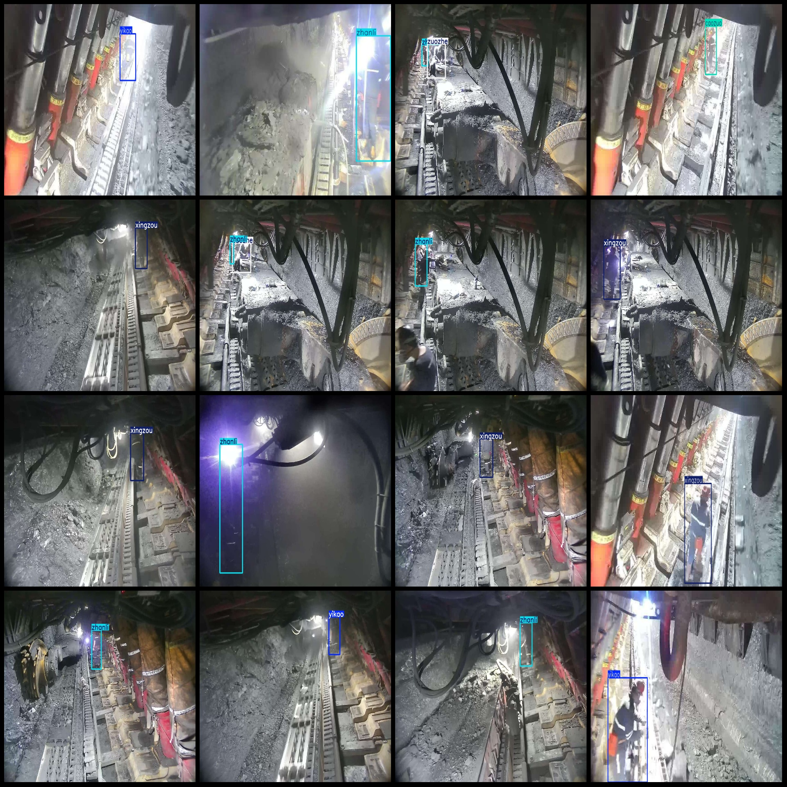
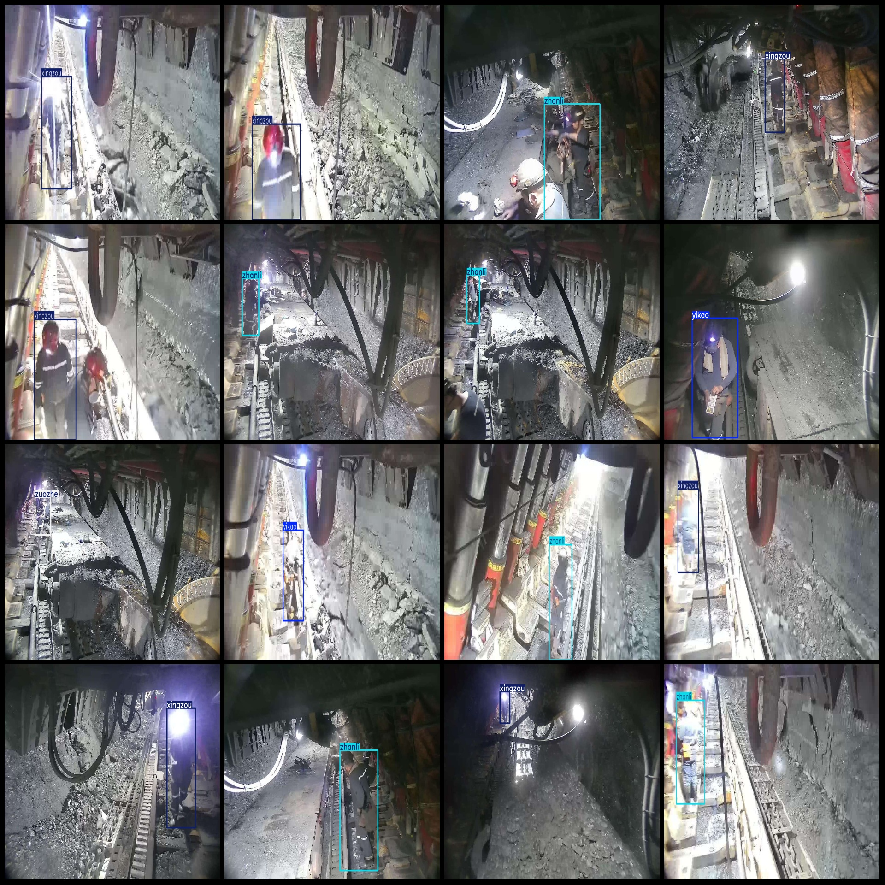

# Intelligent Mining Personnel Behavior State Climbing, Walking, Standing, Falling Detection Dataset VOC+YOLO Format 4847 Images 8 Categories

Dataset format: Pascal VOC format + YOLO format (txt file without split path, only contains jpg images and corresponding VOC format xml files and yolo format txt files)
number of images: 4847  
4847
annotation count: 4847  
annotationnumber of classes: 8  
["caozuo", "diedao", "panpa", "wanyao", "xingzou", "yikao", "zhanli", "zuozhe"]
Number of boxes labeled in each category:
"caozuo" is a Chinese word that means "operation" or "action". 
The number of boxes (or frames) equals to 105.
Diedao(Fall) box count = 69  
Panpa(Climb) box count = 43
"Wanyao" is a Chinese character, which means "to bow" or "to bend." The number "285" is not a Chinese word or phrase.
"xingzou" (walk) box count = 1308  
"yikao" (rest) box count = 903
Zhanli = 2175
"Zuo Zhe" is translated to "Sit Down". The frame count for this phrase is 669.
total boxes: 5557  
images per class:   
caozuo (operation) has 104 pictures
Dieao (Fall) images = 69
"Panpa" is a Chinese term for "climbing" or "ascending." The number "43" is not a part of the English translation, so it has been omitted.
Wanyao (bow) occupies 284 images.
The image file name "xingzou" is a 1266 character long string.
"Yikao" is translated to "lean against." The number "862" is not a standard term in Chinese or English. It appears to be a placeholder for a specific count or number. If you provide more context or clarify the meaning of the placeholder, I can assist further.
The image "zhanli" is a 1998 Chinese football team.
"Zuo Zhe" (sitting) possesses a photo count of 631.
Image resolution: Multi-resolution images, such as 1024 x 768, 856 x 480, etc.
Use annotation tool: labelImg
Annotation rules: draw a rectangle box around the class.
Important notes: The dataset does not have a split into training, validation, and test sets; it must be manually split.
Special statement: This dataset does not guarantee any accuracy in the trained model or weight file.
Image preview:
## Images

Here is a pay link on Stripe ( https://buy.stripe.com/3cs8yP7sY87d0vu9AB ). Please contact me lonlonago@foxmail.com after funding $89, and I will send you a complete data files , thank you!

